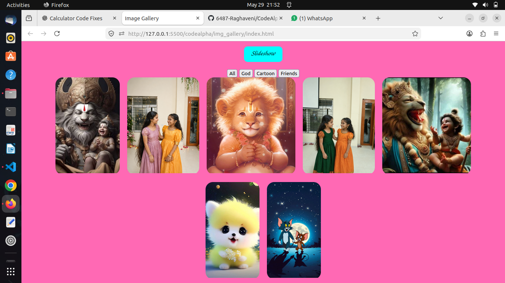
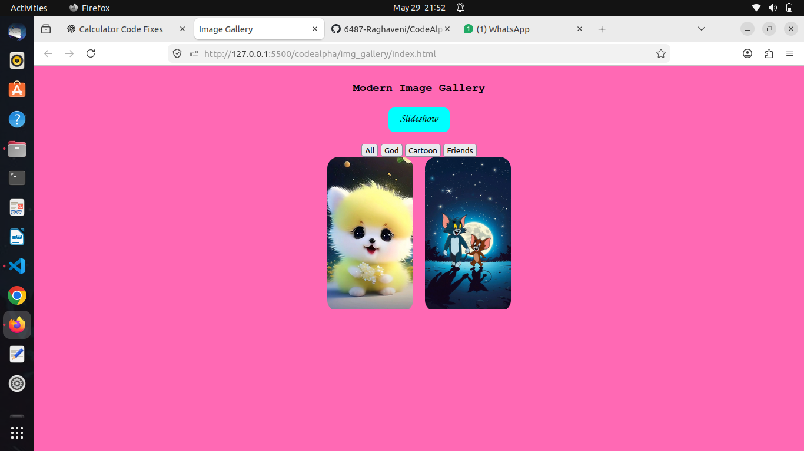
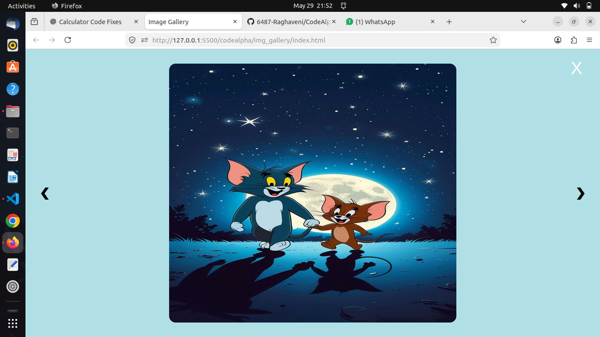

# 🌟 Modern Image Gallery

A modern, responsive, and interactive Image Gallery built using HTML, CSS, and JavaScript.

This project provides an engaging image viewing experience with popup previews, slideshow functionality, keyboard navigation, hover animations, responsive design, and image category filtering.

# 🚀 Features

✅ Responsive Gallery Layout
✅ Interactive Lightbox Popup
✅ Previous & Next Image Navigation
✅ Automatic Slideshow
✅ Keyboard Navigation Support
✅ Hover Zoom Effects
✅ Smooth CSS Transitions
✅ Click Outside Popup to Close
✅ Modern User Interface
✅ Image Categories / Filters
✅ Responsive Design for Different Screen Sizes

# 🛠 Technologies Used

* HTML5
* CSS3
* JavaScript
* DOM Manipulation
* Flexbox Layout
* CSS Hover Effects
* CSS Animations & Transitions
* Keyboard Events

# 📂 Project Structure

img_gallery/
│
├── index.html
├── style.css
├── script.js
├── README.md
│
├── images/
│   ├── 1.jpg
│   ├── 2.png
│   ├── 3.jpg
│   ├── 4.png
│   ├── 5.jpg
│   ├── 6.jpg
│   └── 7.jpg
│
└── working/
    ├── home.png
    ├── category.png
    └── slideshow.png

# 🎯 Functionalities Implemented

## 🖼 Gallery Display

Images are displayed in a responsive gallery layout using Flexbox.

## 🔍 Lightbox Popup

Clicking an image opens it inside a popup preview window for better viewing experience.

## ⏭ Previous & Next Navigation

Users can navigate between images using previous and next buttons.

## ⌨ Keyboard Support

* Right Arrow → Next Image
* Left Arrow → Previous Image
* ESC → Close Popup

## 🎞 Slideshow Feature

The slideshow automatically changes images after a fixed interval.

## ✨ Hover Effects & Animations

Images smoothly zoom on hover with glowing shadow effects and smooth transitions.

## 📱 Responsive Design

Gallery automatically adjusts according to different screen sizes and devices.

# 📸 Project Screenshots

## 🏠 Main Gallery View

## 🔍 Category Preview

## 🎞 Slideshow View

# 🧠 Concepts Learned

* DOM Manipulation
* Event Handling
* JavaScript Functions
* Arrays
* Keyboard Events
* CSS Flexbox
* Hover Effects
* Responsive Web Design
* Popup / Modal Design

# 🚀 How to Run the Project

## Step 1

Clone this repository:
 
 https://github.com/6487-Raghaveni/CodeAlpha_Calculator

## Step 2

Open the project folder.

## Step 3

Run `index.html` in any modern browser.

# 🔗 Project Links

## GitHub Repository

https://github.com/6487-Raghaveni/CodeAlpha_Calculator

## LinkedIn Profile
 
https://www.linkedin.com/in/donthula-raghaveni-4b084940a?utm_source=share_via&utm_content=profile&utm_medium=member_android

# 💼 Internship Project

This project was developed as part of the Frontend Development Internship at CodeAlpha.

# ⭐ Future Improvements

* Dark/Light Theme Toggle
* Fullscreen Preview
* Favorite Images Section
* Image Search Feature
* Auto Image Loading
* Masonry Grid Layout
* Drag & Drop Slideshow

# 👩‍💻 Author

Donthula Raghaveni

Frontend Development Enthusiast 🚀

Passionate about building responsive and interactive web applications using HTML, CSS, and JavaScript.
